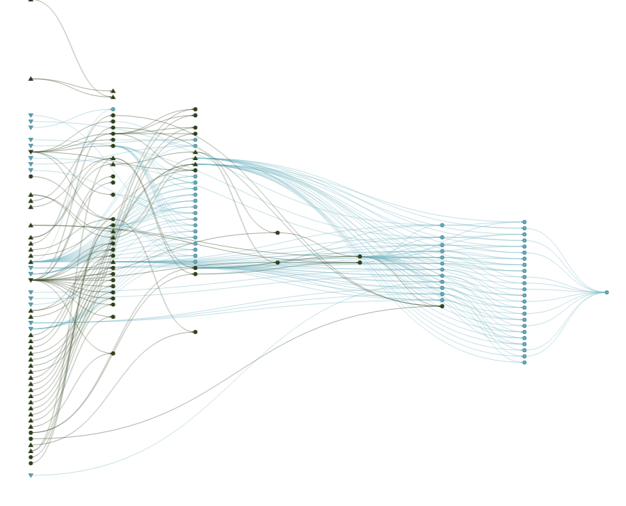

```{r setup, echo=FALSE}

library(tibble)
library(gt)
library(targets)
library(visNetwork)
```

# Setting the scene

:::: columns

::: {.column width="66%"}

:::

::: {.column width="33%" .fragment}

::: {style="font-size: 0.7em;"}
- Workflows are in your head
- Poor documentation??
- Forget dependencies
- Work starts off simple -> snowballs into 4,000 line nightmare
- All your processing done in output (shiny / quarto etc...)
:::

:::

::::

# Typical workflow

1.  Get data
1.  Wrangle data
1.  Calculate 'stuff'
1.  Visualise
1.  Report/publish

# {targets} package intro

[Targets](https://books.ropensci.org/targets) is a pipeline tool for statistics and data science. It compiles all the tasks in a given pipeline (project) and only runs/computes them when things change. Dependencies are ALL automatically processed.

It's a function-orientated programming approach to managing workflow.

#
:::: columns

::: {.column width="50%"}
::: {style="font-size: 0.9em;"}
## ✅ Pros

- Forces functional programming
- Scales well to large workflows
- Aids reproducible pipelines
- Efficient incremental builds (reduces duplication)
- Dependency tracking - don't worry about order of code
- Facilitates collaboration
:::
:::

::: {.column width="50%"}
::: {style="font-size: 0.9em;"}
## ⚠️ Cons

- Forces functional programming
- Less suited for quick ad hoc analysis
- Initial setup can be complex
- Debugging pipelines can be tricky
- Repeat authentication if external data connection
:::
:::

::::

# Alternatives and complements

::: {style="font-size: 0.9em;"}
1.  [systemPipeR](https://systempipe.org) - grounded in bio-stats, command line driven
1.  [Nextflow](https://www.nextflow.io) - unix based, git integration, HPC, probably suit production environment
1.  [Snakemake](https://snakemake.github.io) - python equivalent (?) of targets

- [tarborist](github.com/tylermorganwall/tarborist) - indexes your targets pipeline making it easier to inspect and navigate structure
- [arrow](https://arrow.apache.org/docs/r/) - efficient read/write of (parquet) data files.
- rmkd and quarto - integrating target objects into outputs.
- [testthat](https://testthat.r-lib.org/) - build in unit test of your functions
:::

# Basic walk-through

## Set-up

Like my middle name, this is basic. For a better and more detailed walk-through please visit [here](https://books.ropensci.org/targets/) or [here](https://carpentries-incubator.github.io/targets-workshop/basic-targets.html).

```{r}

library(targets) # load package
tar_script() # creates 'dummy' targets script (beware, will overwrite if you
# already have one!)

# Create the "R" directory for functions to sit if it doesn't exist
if (!dir.exists("R")) {
  dir.create("R")
}

# Create some blank function scripts to reflect your workflow
# You could just create 1 e.g. 'Functions.R' but I prefer grouping
files <- c("data_grab.R", "data_wrangle.R", "plot_data.R")
paths <- file.path("R", files)

file.create(paths[!file.exists(paths)])
```

## Writing functions

### Grab data

```{r}

#' retrieve data from a specific location in directory
#' @param file where the file is stored
#' @returns a dataframe of hospital admission activity

get_data <- function(file){
  
  data <- read.csv(file)
  
  return(data)
}

```

### Wrangle data

```{r}

#' create some metrics from grouped data
#' @param data the target object with relevant data
#' @param group the variable in the data to group by
#' @returns an aggregate dataframe ready for plotting

wrangle_data <- function(data,group){
  
  wrangled <- data |>
    group_by({{ group }}) |>
    summarise(spells = sum(spells),
              los = sum(los),
              patients = sum(patients)) |>
    ungroup() |>
    rename(group = {{ group }}) |>
    mutate(spells_per_pat = round(spells/patients,2),
           avg_los = round(los/spells,2))
  
  return(wrangled)
}

```

### Plot data

```{r}

#' create a plot of our data
#' @param data the target object with relevant data
#' @returns a lovely plot of our data


plot_data <- function(data){
  
  plot <- data |>
    ggplot() +
    geom_col(aes(x=as.character(group), y=avg_los), fill = "skyblue") +
    labs(title = "Really great insights on length of stay",
         subtitle = "Woohoo, let's go!",
         x = "Group",
         y = "Value")
  
  return(plot)
}

```

## Creating targets (_targets.R script)

```{r}

library(targets)
library(tarchetypes)

tar_source()

tar_option_set(packages = c("tidyverse"))

# End this file with a list of target objects.
list(
  tar_target(data,
             get_data("data/apcs_2425.csv")),
  
  tar_target(wrangle,
             wrangle_data(data, age)),
  
  tar_target(plot,
             plot_data(wrangle))
)

```

## Running the pipeline

```{r}

tar_make()

```

## Visualising the pipeline

```{r}
#| eval: true
#| error: false
#| warning: false
#| message: false
#| echo: false

targets::tar_visnetwork()

```

## Checking your results

```{r}
#| eval: true

targets::tar_read(plot)

```

## Making changes

So those pesky clients of yours have now decided they want something different:

1.  They don't like sky-blue and would like the chart in dark-olive-green instead!
1.  More interested in ethnic category than age group
1.  They've just re-run their activity query and have a file for a new year

::: {style="font-size: 1.3em;" .fragment}
**Cut away for live demonstration...**
:::

# Other examples

## 1.Care-shift Tracker

:::: columns

::: {.column width="70%"}


:::

::: {.column width="30%" .fragment}

:::

::::

## 2.Mencap LD cohort & analysis

:::: columns

::: {.column width="20%"}


:::

::: {.column width="60%" .fragment}

:::

::: {.column width="20%" .fragment}


:::

::::

# Useful target functions...

- tar_prune() - removes redundant targets
- tar_destroy() - go nuclear (destroys all targets)!
- tar_objects() - list of all current targets
- tar_delete(*target_name*) - remove specific target
- getSrcFilename(*function_name*) - find source file of a specific function

# Testimonials (1)

::: {.speech-bubble .fragment}
::: {style="font-size: 0.7em;"}
"I would like to calmly and freely state - certainly without a manager pointing a gun at me - that the targets R package is fantastic. Before it entered my life, my analysis lived across dozens of mysteriously named scripts with embedded functions hiding in plain sight. Changing one line meant re-running everything in a careful order hoping I hadn’t missed one of the steps.
Now, and I cannot stress enough that I am saying this of my own volition, targets tracks dependencies and only reruns what’s affected, which feels less like coding and more like being gently guided by a very competent but slightly controlling assistant.
Small changes no longer trigger full existential crises—or full pipeline reruns. It’s efficient and reproducible. Five stars. Please let me leave now. I have a family." - Alex L
:::
:::

# Testimonials (2)

::: {.speech-bubble .fragment}
"Was proper reet bloody great" - Jac G
:::

::: {.speech-bubble .fragment}
::: {style="font-size: 0.8em;"}
"Told A&M what to do with {targets} in total lay-terms with no jargon. They're all incompetent, did it totally wrong. Idiots!" - Matt D
:::
:::

::: {.speech-bubble .fragment}
::: {style="font-size: 0.8em;"}
"Isn't cheese wonderful? Love a drop of Wensleydale melted on a slice of freshly home-baked and toasted seeded batch. Mmmmmmm" - Craig P
:::
:::

# Testimonials (3)

::: {.speech-bubble .fragment}
::: {style="font-size: 0.9em;"}
"I find targets most useful for data wrangling as it saves time not having to keep re-running the same code, helps simplify your output scripts and rendering them quicker.
I used it for the positive deviance work where I was running lots of different regression models which were slow to compute - with targets you just run them once and the results are stored; then you can refer back to those versions as and when needed." - Sarah L
:::
:::

# Contributions and questions from the floor...

