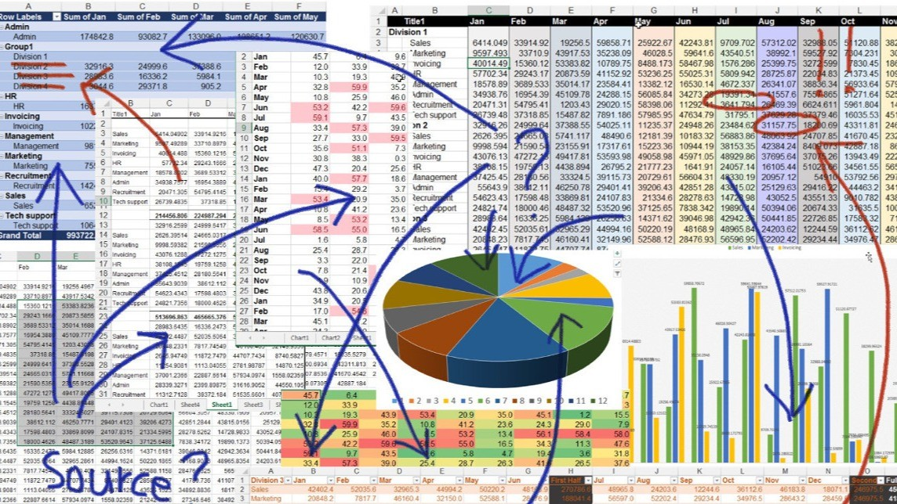
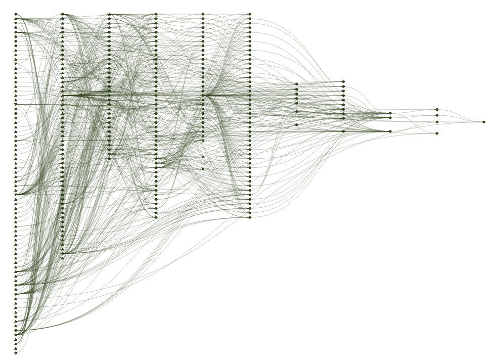
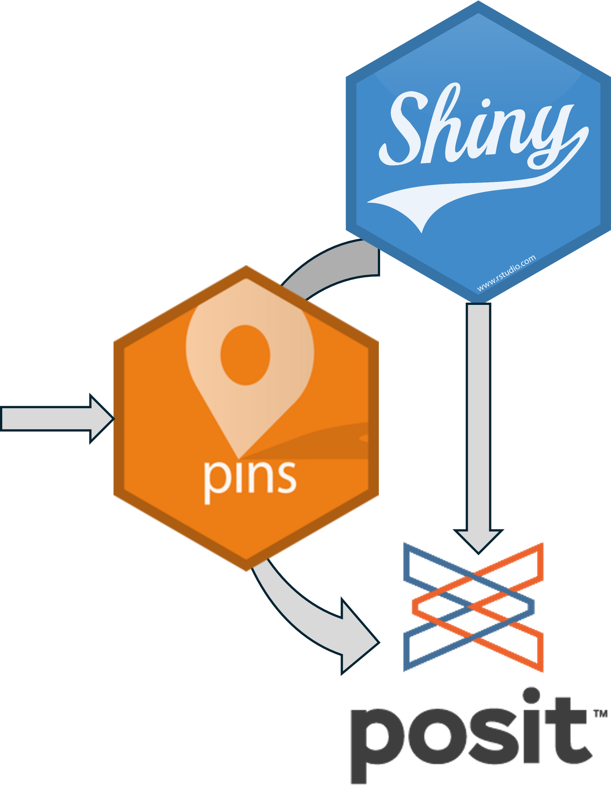

```{r setup, echo=FALSE}

library(tibble)
library(gt)
```

## Setting the scene

:::: columns

::: {.column width="66%"}

:::

::: {.column width="33%" .fragment}

::: {style="font-size: 0.8em;"}
- Workflows are in your head
- Poor documentation??
- Forget dependencies
- Work starts off simple -> snowballs into 4,000 line nightmare
- All your processing done in output (shiny / quarto etc...)
:::

:::

::::

## Typical workflow

1.  Get data
1.  Wrangle data
1.  Calculate 'stuff'
1.  Visualise
1.  Report/publish

## {targets} package intro

[Targets](https://books.ropensci.org/targets) is a pipeline tool for statistics and data science. It compiles all the tasks in a given pipeline (project) and only runs/computes them when things change. Dependencies are ALL automatically processed.

It's a function-orientated programming approach.

## Testimonials...?

::: {.speech-bubble .fragment}
"Was reet bloody great" - Jac G
:::

::: {.speech-bubble .fragment}
"What time's the ruggers on Jeeves?" - Alex L
:::


## Pro's and Con's...

:::: columns

::: {.column width="50%"}
### ✅ Pros

- Forces functional programming
- Aids reproducible pipelines
- Efficient incremental builds
- Scales well to large workflows
- Strong dependency tracking
:::

::: {.column width="50%"}
### ⚠️ Cons

- Forces functional programming
- Initial setup can be complex
- Debugging pipelines can be tricky
- Requires structured project design
- Less suited for quick ad hoc analysis
:::

::::

## Alternatives and complements

1.  [systemPipeR](https://systempipe.org) - grounded in bio-stats, command line driven
1.  [Nextflow](https://www.nextflow.io) - unix based, git integration, HPC, probably suit production environment
1.  [Snakemake](https://snakemake.github.io) - python equivalent (?) of targets

- [tarborist](github.com/tylermorganwall/tarborist) - indexes your targets pipeline making it easier to inspect and navigate structure

## Basic walk-through


## Other examples

### 1.Care-shift Tracker

:::: columns

::: {.column width="70%"}


:::

::: {.column width="30%" .fragment}

:::

::::

## Contributions from the floor

